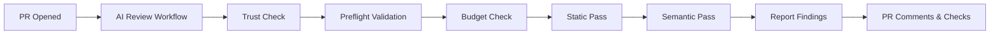

# 🐝 odd-ai-reviewers

[](https://github.com/oddessentials/odd-ai-reviewers/actions/workflows/ci.yml)

[](LICENCE.md)

**Extensible AI code review for pull requests** — multi-pass analysis with pluggable agents, all without modifying your CI runtime.

## Features

- 🔍 **Multi-Pass Review**: Static analysis first (free), then AI semantic review
- 🔌 **Pluggable Agents**: Semgrep, OpenCode.ai, PR-Agent, local LLMs (Ollama)
- 💰 **Cost Controls**: Per-PR and monthly budget limits with automatic enforcement
- 🔒 **Secure by Default**: Fork PRs blocked, secrets never logged
- 📝 **Rich Reporting**: PR comments, inline annotations, check summaries
- ⚙️ **Zero CI Changes**: Works via reusable workflows — just add one file

## Quick Start

### 1. Add the workflow to your repository

Create `.github/workflows/ai-review.yml`:

```yaml
name: AI Review

on:
  pull_request:
    types: [opened, synchronize, reopened, ready_for_review]

jobs:
  ai-review:
    if: github.event.pull_request.head.repo.full_name == github.repository
    uses: oddessentials/odd-ai-reviewers/.github/workflows/ai-review.yml@main
    with:
      target_repo: ${{ github.repository }}
      target_ref: ${{ github.sha }}
      pr_number: ${{ github.event.pull_request.number }}
    secrets: inherit
```

### 2. Add your configuration

Create `.ai-review.yml` at your repository root:

```yaml
version: 1
trusted_only: true

passes:
  - name: static
    agents: [semgrep]
  - name: semantic
    agents: [opencode]

# Model configuration (REQUIRED)
# Must specify either here or via MODEL env var
models:
  default: claude-sonnet-4-20250514 # or gpt-4o-mini for OpenAI

limits:
  max_usd_per_pr: 1.00
  monthly_budget_usd: 100

reporting:
  github:
    mode: checks_and_comments
    max_inline_comments: 20
```

### 3. Configure secrets

Add these secrets to your repository or organization:

| Secret              | When Required                       | Description                                   |
| ------------------- | ----------------------------------- | --------------------------------------------- |
| `MODEL`             | Always (or set `models.default`)    | Model name (e.g., `claude-sonnet-4-20250514`) |
| `ANTHROPIC_API_KEY` | When using `claude-*` models        | Anthropic API key                             |
| `OPENAI_API_KEY`    | When using `gpt-*` or `o1-*` models | OpenAI API key                                |
| `OLLAMA_BASE_URL`   | Optional (defaults to sidecar)      | Ollama server URL                             |

> **⚠️ Model-Provider Match**: The router validates that your model matches your API key. Using a `claude-*` model without `ANTHROPIC_API_KEY` will fail preflight.

## How It Works



1. **Trigger**: PR is opened or updated
2. **Trust Check**: Fork PRs are blocked by default
3. **Preflight**: Validates model config and API keys match
4. **Budget Check**: Limits on files, lines, tokens, and cost
5. **Static Pass**: Free tools like Semgrep run first
6. **Semantic Pass**: AI agents analyze the diff (if within budget)
7. **Report**: Findings posted as comments and check annotations

## Available Agents

| Agent       | Type   | Description                          |
| ----------- | ------ | ------------------------------------ |
| `semgrep`   | Static | Security and bug patterns (free)     |
| `reviewdog` | Static | Annotation converter (Phase 2)       |
| `opencode`  | AI     | OpenCode.ai semantic review          |
| `pr_agent`  | AI     | PR summarizer and reviewer (Phase 2) |
| `local_llm` | AI     | Ollama/llama.cpp (Phase 3)           |

## Configuration Reference

See [docs/config-schema.md](docs/config-schema.md) for the full configuration reference.

## Using Local LLM (Ollama)

The `local_llm` agent provides air-gapped, local AI code review using Ollama.

### Configuration

Set these environment variables in your CI:

| Variable             | Required | Default                       | Description                 |
| -------------------- | -------- | ----------------------------- | --------------------------- |
| `OLLAMA_BASE_URL`    | Yes      | `http://ollama-sidecar:11434` | Ollama API endpoint         |
| `OLLAMA_MODEL`       | No       | `codellama:7b`                | Model to use                |
| `LOCAL_LLM_OPTIONAL` | No       | `false`                       | Enable graceful degradation |

### Fail-Closed Behavior (Default)

By default, CI **fails** if Ollama is unavailable. This ensures code review is never silently skipped.

Set `LOCAL_LLM_OPTIONAL=true` to continue when Ollama is unavailable (use with caution).

### Running with OSCR

When running inside [OSCR](https://github.com/oddessentials/odd-self-hosted-ci-runtime) runner containers, configure `OLLAMA_BASE_URL` to point to your Ollama service.

See [OSCR Integration Guide](docs/OSCR-INTEGRATION.md) for conceptual overview and [Local LLM Setup](docs/LOCAL-LLM-SETUP.md) for configuration details.

## Documentation

### Core Documentation

- [System Specification](docs/SPEC.md) - Architecture and design specification
- [GitHub Setup Guide](docs/github-setup.md)
- [Configuration Schema](docs/config-schema.md)
- [Security Model](docs/security.md)
- [Cost Controls](docs/cost-controls.md)

### Local LLM (Ollama)

- [Local LLM Setup](docs/LOCAL-LLM-SETUP.md) - Configuration and behavior
- [OSCR Integration](docs/OSCR-INTEGRATION.md) - Running with self-hosted CI
- [Model Provisioning](docs/MODEL-PROVISIONING.md) - Air-gapped model deployment

## Development

```bash
# Install dependencies
npm install

# Build the router
npm run build

# Run locally
node router/dist/main.js review \
  --repo /path/to/repo \
  --base main \
  --head feature-branch \
  --dry-run
```

## Roadmap

- **Phase 1** ✅: Core router, Semgrep, OpenCode.ai, GitHub workflows
- **Phase 2**: PR-Agent, caching, comment throttling
- **Phase 3**: Azure DevOps, GitLab, Gitea, local LLMs

## Licence

This project is licenced under the MIT Licence - see the [LICENCE.md](LICENCE.md) file for details.
