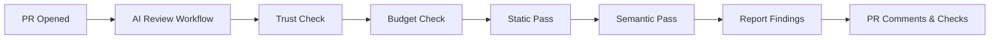

# odd-ai-reviewers

[](https://opensource.org/licenses/MIT)

**Extensible AI code review for pull requests** — multi-pass analysis with pluggable agents, all without modifying your CI runtime.

## Features

- 🔍 **Multi-Pass Review**: Static analysis first (free), then AI semantic review
- 🔌 **Pluggable Agents**: Semgrep, OpenCode.ai, PR-Agent, local LLMs (Ollama)
- 💰 **Cost Controls**: Per-PR and monthly budget limits with automatic enforcement
- 🔒 **Secure by Default**: Fork PRs blocked, secrets never logged
- 📝 **Rich Reporting**: PR comments, inline annotations, check summaries
- ⚙️ **Zero CI Changes**: Works via reusable workflows — just add one file

## Quick Start

### 1. Add the workflow to your repository

Create `.github/workflows/ai-review.yml`:

```yaml
name: AI Review

on:
  pull_request:
    types: [opened, synchronize, reopened, ready_for_review]

jobs:
  ai-review:
    if: github.event.pull_request.head.repo.full_name == github.repository
    uses: oddessentials/odd-ai-reviewers/.github/workflows/ai-review.yml@main
    with:
      target_repo: ${{ github.repository }}
      target_ref: ${{ github.sha }}
      pr_number: ${{ github.event.pull_request.number }}
    secrets: inherit
```

### 2. Add your configuration (optional)

Create `.ai-review.yml` at your repository root:

```yaml
version: 1
trusted_only: true

passes:
  - name: static
    agents: [semgrep]
  - name: semantic
    agents: [opencode]

limits:
  max_usd_per_pr: 1.00
  monthly_budget_usd: 100

reporting:
  github:
    mode: checks_and_comments
    max_inline_comments: 20
```

### 3. Configure secrets

Add these secrets to your repository or organization:

| Secret | Required | Description |
|--------|----------|-------------|
| `OPENCODE_API_KEY` | For AI review | OpenCode.ai API key |
| `OPENAI_API_KEY` | For PR-Agent | OpenAI API key |
| `OLLAMA_BASE_URL` | For local LLM | Ollama server URL |

## How It Works



1. **Trigger**: PR is opened or updated
2. **Trust Check**: Fork PRs are blocked by default
3. **Budget Check**: Limits on files, lines, tokens, and cost
4. **Static Pass**: Free tools like Semgrep run first
5. **Semantic Pass**: AI agents analyze the diff (if within budget)
6. **Report**: Findings posted as comments and check annotations

## Available Agents

| Agent | Type | Description |
|-------|------|-------------|
| `semgrep` | Static | Security and bug patterns (free) |
| `reviewdog` | Static | Annotation converter (Phase 2) |
| `opencode` | AI | OpenCode.ai semantic review |
| `pr_agent` | AI | PR summarizer and reviewer (Phase 2) |
| `local_llm` | AI | Ollama/llama.cpp (Phase 3) |

## Configuration Reference

See [docs/config-schema.md](docs/config-schema.md) for the full configuration reference.

## Documentation

- [GitHub Setup Guide](docs/github-setup.md)
- [Configuration Schema](docs/config-schema.md)
- [Security Model](docs/security.md)
- [Cost Controls](docs/cost-controls.md)

## Development

```bash
# Install dependencies
npm install

# Build the router
npm run build

# Run locally
node router/dist/main.js review \
  --repo /path/to/repo \
  --base main \
  --head feature-branch \
  --dry-run
```

## Roadmap

- **Phase 1** ✅: Core router, Semgrep, OpenCode.ai, GitHub workflows
- **Phase 2**: PR-Agent, caching, comment throttling
- **Phase 3**: Azure DevOps, GitLab, Gitea, local LLMs

## License

MIT © OddEssentials
