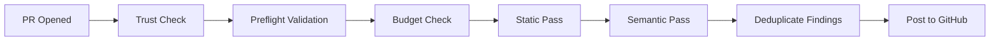

# 🐝 odd-ai-reviewers

[](https://github.com/oddessentials/odd-ai-reviewers/actions/workflows/ci.yml)

[](LICENSE.md)

**Extensible AI code review for pull requests** — multi-pass analysis with pluggable agents, all without modifying your CI runtime.

---

## Features

- 🔍 **Multi-Pass Review** — Static analysis first (free), then AI semantic review
- 🔌 **Pluggable Agents** — Semgrep, OpenCode, PR-Agent, local LLMs (Ollama)
- 💰 **Cost Controls** — Per-PR and monthly budget limits with automatic enforcement
- 🔒 **Secure by Default** — Fork PRs blocked, secrets never logged, agents sandboxed
- 📝 **Rich Reporting** — PR comments, inline annotations, check summaries
- ⚙️ **Zero CI Changes** — Works via reusable workflows

---

## Quick Start (GitHub)

### 1. Add the workflow

Create `.github/workflows/ai-review.yml`:

```yaml
name: AI Review

on:
  pull_request:
    types: [opened, synchronize, reopened, ready_for_review]

jobs:
  ai-review:
    if: github.event.pull_request.head.repo.full_name == github.repository
    uses: oddessentials/odd-ai-reviewers/.github/workflows/ai-review.yml@main
    with:
      target_repo: ${{ github.repository }}
      target_ref: ${{ github.sha }}
      pr_number: ${{ github.event.pull_request.number }}
    secrets: inherit
```

### 2. Add your configuration

Create `.ai-review.yml` at your repository root:

```yaml
version: 1
trusted_only: true

passes:
  - name: static
    agents: [semgrep]
  - name: semantic
    agents: [opencode]

models:
  default: claude-sonnet-4-20250514

limits:
  max_usd_per_pr: 1.00
  monthly_budget_usd: 100
```

### 3. Configure secrets

| Secret              | When Required | Description       |
| ------------------- | ------------- | ----------------- |
| `ANTHROPIC_API_KEY` | Claude models | Anthropic API key |
| `OPENAI_API_KEY`    | GPT/O1 models | OpenAI API key    |
| `OLLAMA_BASE_URL`   | Local LLM     | Ollama endpoint   |

> **⚠️ Model-Provider Match**: The router validates that your model matches your API key.

---

## Available Agents

| Agent                | Type   | Deterministic | Network | Cost    |
| -------------------- | ------ | ------------- | ------- | ------- |
| `semgrep`            | Static | ✅            | ❌      | Free    |
| `reviewdog`          | Static | ✅            | ❌      | Free    |
| `opencode`           | AI     | ❌            | ✅      | Medium  |
| `pr_agent`           | AI     | ❌            | ✅      | Low     |
| `local_llm`          | AI     | ❌            | ❌      | Compute |
| `ai_semantic_review` | AI     | ❌            | ✅      | Medium  |

See [config-schema.md](docs/config-schema.md) for the full Agent Capability Matrix.

---

## Documentation

📖 **[Browse Documentation Online](https://oddessentials.github.io/odd-ai-reviewers/)**

### Using with GitHub

- [GitHub Setup Guide](docs/GITHUB-SETUP.md) — Complete setup instructions
- [Configuration Schema](docs/config-schema.md) — All YAML options

### Using with Azure DevOps _(Roadmap — reporter & pipeline not yet implemented)_

- [Roadmap](docs/ROADMAP.md) — ADO reporter and pipeline template plans

### Using with OSCR (Self-Hosted CI)

- [OSCR Integration](docs/OSCR-INTEGRATION.md) — Conceptual overview
- [Local LLM Setup](docs/LOCAL-LLM-SETUP.md) — Ollama configuration
- [Model Provisioning](docs/MODEL-PROVISIONING.md) — Air-gap deployment

### Controlling Which Agents Run

- [Configuration Schema](docs/config-schema.md) — Passes, agents, limits
- [Cost Controls](docs/COST-CONTROLS.md) — Budget management

### Architecture & Security

- [Architecture](docs/ARCHITECTURE.md) — Execution flow diagrams
- [Security Model](docs/SECURITY.md) — Trust model and threat mitigation
- [Invariants](docs/INVARIANTS.md) — Non-negotiable design constraints
- [Scope](docs/SCOPE.md) — What this project does and doesn't do

---

## How It Works



1. **Trigger** — PR is opened or updated
2. **Trust Check** — Fork PRs blocked by default
3. **Preflight** — Validates model config and API keys
4. **Budget Check** — Enforces file, line, token, and cost limits
5. **Static Pass** — Free tools like Semgrep run first
6. **Semantic Pass** — AI agents analyze the diff
7. **Report** — Findings posted as comments and annotations

---

## Development

```bash
npm install        # Install dependencies
npm run build      # Build the router
npm test           # Run 297 tests
npm run lint       # Check linting
npm run format     # Format code
```

---

## Roadmap

See [docs/ROADMAP.md](docs/ROADMAP.md) for planned features:

- 🔴 **Azure DevOps** — Reporter and pipeline template
- 🟢 **GitLab** — Future consideration
- 🟢 **Gitea** — Future consideration

---

## License

This project is licensed under the MIT License - see the [LICENSE.md](LICENSE.md) file for details.
