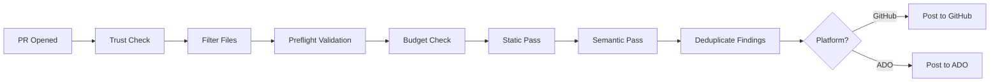

# 🐝 Odd AI Reviewers

**Extensible AI code review for pull requests** — multi-pass analysis with pluggable agents for **GitHub** and **Azure DevOps**.

[](https://github.com/oddessentials/odd-ai-reviewers/actions/workflows/dogfood-review.yml)
[](https://github.com/oddessentials/odd-ai-reviewers/actions/workflows/ci.yml)


[](LICENSE.md)


[](https://prettier.io/)
[](https://conventionalcommits.org)
[](https://trivy.dev/)
[](https://github.com/oddessentials/odd-ai-reviewers/pulls)
[](https://github.com/oddessentials/odd-ai-reviewers/commits/main)

---

## 👋 Meet the Team

[](docs/reference/review-team.md)

**[Click here to meet the AI-powered code review team →](docs/reference/review-team.md)**

🎥 <a href="https://youtu.be/rkDQ7ZA47XQ" target="_blank" rel="noopener noreferrer">
Click here to watch the trailer on YouTube →</a>

---

## ✨ Features

- 🔍 **Multi-Pass Review** — Static analysis first (free), then AI semantic review
- 🔌 **Pluggable Agents** — Semgrep, OpenCode, PR-Agent, local LLMs (Ollama)
- 💰 **Cost Controls** — Per-PR and monthly budget limits with automatic enforcement
- 🔒 **Secure by Default** — Fork PRs blocked, secrets never logged, agents sandboxed
- 📝 **Rich Reporting** — PR comments, inline annotations, check summaries
- 🌐 **Multi-Platform** — GitHub Actions and Azure DevOps Pipelines
- ⚙️ **Zero CI Changes** — Works via reusable workflows
- 📁 **Flexible Filtering** — `.reviewignore` files and path filters to control what gets reviewed

---

## 🚀 Quick Start (GitHub)

### 1. Add the workflow

Create `.github/workflows/ai-review.yml`:

```yaml
name: AI Review

on:
  pull_request:
    types: [opened, synchronize, reopened, ready_for_review]

jobs:
  ai-review:
    if: github.event.pull_request.head.repo.full_name == github.repository
    uses: oddessentials/odd-ai-reviewers/.github/workflows/ai-review.yml@main
    with:
      target_repo: ${{ github.repository }}
      target_ref: ${{ github.sha }}
      pr_number: ${{ github.event.pull_request.number }}
    secrets: inherit
```

### 2. Add your configuration

Create `.ai-review.yml` at your repository root:

```yaml
version: 1
trusted_only: true

passes:
  - name: static
    agents: [semgrep]
  - name: semantic
    agents: [opencode]

models:
  default: claude-sonnet-4-20250514

limits:
  max_usd_per_pr: 1.00
  monthly_budget_usd: 100
```

### 3. Configure secrets

| Secret              | When Required | Description       |
| ------------------- | ------------- | ----------------- |
| `ANTHROPIC_API_KEY` | Claude models | Anthropic API key |
| `OPENAI_API_KEY`    | GPT/O1 models | OpenAI API key    |
| `OLLAMA_BASE_URL`   | Local LLM     | Ollama endpoint   |

> **⚠️ Model-Provider Match**: The router validates that your model matches your API key. See [Model-Provider Matching](#-model-provider-matching) below.

---

## 🔗 Model-Provider Matching

The router **does not auto-switch providers**. Your `MODEL` setting must match the API key you provide.

### Provider Precedence

When multiple API keys are configured:

1. **Anthropic wins** — If `ANTHROPIC_API_KEY` is set, Anthropic is used (for supported agents)
2. **Azure OpenAI** — If all Azure keys are set (API key, endpoint, deployment)
3. **OpenAI** — If only `OPENAI_API_KEY` is set

### Common Mistakes

| Configuration                                                | Result                                                           | Fix                                                                |
| ------------------------------------------------------------ | ---------------------------------------------------------------- | ------------------------------------------------------------------ |
| `ANTHROPIC_API_KEY` + `OPENAI_API_KEY` + `MODEL=gpt-4o-mini` | ❌ **404 Error** — Anthropic wins but doesn't know `gpt-4o-mini` | Use `MODEL=claude-sonnet-4-20250514` or remove `ANTHROPIC_API_KEY` |
| `OPENAI_API_KEY` + `MODEL=claude-3-opus`                     | ❌ **404 Error** — OpenAI doesn't know `claude-3-opus`           | Add `ANTHROPIC_API_KEY` or use `MODEL=gpt-4o-mini`                 |

### Valid Configurations

```bash
# ✅ Anthropic only
ANTHROPIC_API_KEY=sk-ant-xxx
MODEL=claude-sonnet-4-20250514

# ✅ OpenAI only
OPENAI_API_KEY=sk-xxx
MODEL=gpt-4o-mini

# ✅ Both keys, Claude model (Anthropic wins, model matches)
ANTHROPIC_API_KEY=sk-ant-xxx
OPENAI_API_KEY=sk-xxx
MODEL=claude-sonnet-4-20250514

# ❌ Both keys, GPT model (Anthropic wins, model MISMATCHES → 404)
ANTHROPIC_API_KEY=sk-ant-xxx
OPENAI_API_KEY=sk-xxx
MODEL=gpt-4o-mini  # Will fail preflight!
```

### Troubleshooting 404 Errors

If you see a 404 error during AI code review:

1. **Check your MODEL setting** — Does it match your provider?
2. **Check which keys are set** — Remember: Anthropic takes precedence
3. **Run preflight validation** — The router will tell you exactly what's wrong

---

## 🤖 Available Agents

| Agent                | Type   | Deterministic | Network | Cost    |
| -------------------- | ------ | ------------- | ------- | ------- |
| `semgrep`            | Static | ✅            | ❌      | Free    |
| `reviewdog`          | Static | ✅            | ❌      | Free    |
| `opencode`           | AI     | ❌            | ✅      | Medium  |
| `pr_agent`           | AI     | ❌            | ✅      | Low     |
| `local_llm`          | AI     | ❌            | ❌      | Compute |
| `ai_semantic_review` | AI     | ❌            | ✅      | Medium  |

See [config-schema.md](docs/configuration/config-schema.md) for the full Agent Capability Matrix.

---

## 📚 Documentation

📖 **[Browse Documentation Online](https://oddessentials.github.io/odd-ai-reviewers/)**

### Using with GitHub

- [GitHub Setup Guide](docs/platforms/github/setup.md) — Complete setup instructions
- [Configuration Schema](docs/configuration/config-schema.md) — All YAML options

### Using with Azure DevOps

- [Azure DevOps Setup Guide](docs/platforms/azure-devops/setup.md) — Complete setup instructions
- [ADO + OSCR Free Example](docs/examples/azure-devops-free.md) — Free tier with Ollama
- [Roadmap](docs/reference/roadmap.md) — Platform support status

### Using with OSCR (Self-Hosted CI)

- [OSCR Integration](docs/platforms/oscr/integration.md) — Conceptual overview
- [Local LLM Setup](docs/platforms/oscr/local-llm-setup.md) — Ollama configuration
- [Model Provisioning](docs/platforms/oscr/model-provisioning.md) — Air-gap deployment

### Controlling What Gets Reviewed

- [Configuration Schema](docs/configuration/config-schema.md) — Passes, agents, limits, path filters, `.reviewignore`
- [Cost Controls](docs/configuration/cost-controls.md) — Budget management

### Architecture & Security

- [Architecture](docs/architecture/overview.md) — Execution flow diagrams
- [Security Model](docs/architecture/security.md) — Trust model and threat mitigation
- [Invariants](docs/architecture/invariants.md) — Non-negotiable design constraints
- [Scope](docs/architecture/scope.md) — What this project does and doesn't do

---

## ⚙️ How It Works



1. **Trigger** — PR is opened or updated
2. **Trust Check** — Fork PRs blocked by default
3. **Filter Files** — Apply `.reviewignore` and `path_filters` exclusions (see [Architecture](docs/architecture/overview.md#file-filtering) for details)
4. **Preflight** — Validates model config and API keys
5. **Budget Check** — Enforces file, line, token, and cost limits
6. **Static Pass** — Free tools like Semgrep run first
7. **Semantic Pass** — AI agents analyze the diff
8. **Report** — Findings posted as comments and annotations

---

## 🛠️ Development

### Prerequisites

- **Node.js** ≥22.0.0
- **pnpm** ≥9 (via Corepack)

```bash
corepack enable    # Enable pnpm via Corepack
pnpm install       # Install dependencies
```

> **Note**: npm is not supported. Running `npm install` will display an error with instructions to use pnpm.

### Project Structure

```
router/           # Core review router (TypeScript)
├── src/          # Source code
└── tests/        # Unit tests
docs/             # Documentation (Markdown)
├── viewer/       # Documentation viewer (GitHub Pages)
└── *.md          # Documentation files
scripts/          # Build and dev tooling
tests/            # Integration tests
└── docs-viewer/  # Documentation viewer tests
specs/            # Feature specifications
```

### Common Commands

| Command          | Description              |
| ---------------- | ------------------------ |
| `pnpm build`     | Build the router         |
| `pnpm test`      | Run unit tests           |
| `pnpm lint`      | Check linting (ESLint)   |
| `pnpm format`    | Format code (Prettier)   |
| `pnpm typecheck` | TypeScript type checking |
| `pnpm verify`    | Run all quality gates    |

### Testing

```bash
pnpm test                             # Run unit tests
pnpm --filter router test:ci:coverage # Run tests with coverage
pnpm test:docs-viewer                 # Run documentation viewer tests
```

### Documentation Development

The documentation viewer supports live reload during development:

```bash
pnpm docs:dev        # Start dev server with live reload (http://localhost:3000)
pnpm docs:manifest   # Regenerate docs manifest
pnpm docs:linkcheck  # Verify documentation links
```

The dev server watches for changes to `docs/**/*.md` and `docs/viewer/*`, automatically regenerating the manifest and reloading the browser.

### Quality Gates

All PRs must pass these checks (enforced by CI):

- **Linting**: `pnpm lint` (ESLint with security rules)
- **Formatting**: `pnpm format:check` (Prettier)
- **Type Safety**: `pnpm typecheck` (TypeScript strict mode)
- **Tests**: `pnpm test` (Vitest with coverage thresholds)
- **Dependencies**: `pnpm depcruise` (circular dependency detection)

Run all gates locally with: `pnpm verify`

---

## 🌐 Platform Support

| Platform       | Status      | Documentation                                     |
| -------------- | ----------- | ------------------------------------------------- |
| GitHub Actions | ✅ Complete | [GitHub Setup](docs/platforms/github/setup.md)    |
| Azure DevOps   | ✅ Complete | [ADO Setup](docs/platforms/azure-devops/setup.md) |
| GitLab CI      | 🔴 Planned  | [Roadmap](docs/reference/roadmap.md)              |
| Gitea Actions  | 🔴 Planned  | [Roadmap](docs/reference/roadmap.md)              |

---

## 📛 Odd AI Reviewer Custom badges

[](https://github.com/oddessentials/odd-ai-reviewers/actions/workflows/dogfood-review.yml)

```

[](https://github.com/<OWNER>/<REPO>/actions/workflows/ai-review.yml)

```

**[Click here to see custom badge templates →](docs/reference/custom-badges.md)**

---

## 📄 License

This project is licensed under the MIT License - see the [LICENSE.md](LICENSE.md) file for details.
