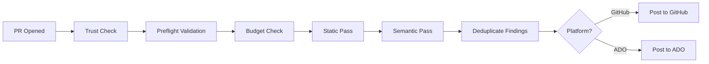

# 🐝 odd-ai-reviewers

[](https://github.com/oddessentials/odd-ai-reviewers/actions/workflows/ci.yml)


[](LICENSE.md)


[](https://prettier.io/)
[](https://conventionalcommits.org)
[](https://trivy.dev/)

**Extensible AI code review for pull requests** — multi-pass analysis with pluggable agents for **GitHub** and **Azure DevOps**.

---

## Features

- 🔍 **Multi-Pass Review** — Static analysis first (free), then AI semantic review
- 🔌 **Pluggable Agents** — Semgrep, OpenCode, PR-Agent, local LLMs (Ollama)
- 💰 **Cost Controls** — Per-PR and monthly budget limits with automatic enforcement
- 🔒 **Secure by Default** — Fork PRs blocked, secrets never logged, agents sandboxed
- 📝 **Rich Reporting** — PR comments, inline annotations, check summaries
- 🌐 **Multi-Platform** — GitHub Actions and Azure DevOps Pipelines
- ⚙️ **Zero CI Changes** — Works via reusable workflows

---

## Quick Start (GitHub)

### 1. Add the workflow

Create `.github/workflows/ai-review.yml`:

```yaml
name: AI Review

on:
  pull_request:
    types: [opened, synchronize, reopened, ready_for_review]

jobs:
  ai-review:
    if: github.event.pull_request.head.repo.full_name == github.repository
    uses: oddessentials/odd-ai-reviewers/.github/workflows/ai-review.yml@main
    with:
      target_repo: ${{ github.repository }}
      target_ref: ${{ github.sha }}
      pr_number: ${{ github.event.pull_request.number }}
    secrets: inherit
```

### 2. Add your configuration

Create `.ai-review.yml` at your repository root:

```yaml
version: 1
trusted_only: true

passes:
  - name: static
    agents: [semgrep]
  - name: semantic
    agents: [opencode]

models:
  default: claude-sonnet-4-20250514

limits:
  max_usd_per_pr: 1.00
  monthly_budget_usd: 100
```

### 3. Configure secrets

| Secret              | When Required | Description       |
| ------------------- | ------------- | ----------------- |
| `ANTHROPIC_API_KEY` | Claude models | Anthropic API key |
| `OPENAI_API_KEY`    | GPT/O1 models | OpenAI API key    |
| `OLLAMA_BASE_URL`   | Local LLM     | Ollama endpoint   |

> **⚠️ Model-Provider Match**: The router validates that your model matches your API key. See [Model-Provider Matching](#model-provider-matching) below.

---

## Model-Provider Matching

The router **does not auto-switch providers**. Your `MODEL` setting must match the API key you provide.

### Provider Precedence

When multiple API keys are configured:

1. **Anthropic wins** — If `ANTHROPIC_API_KEY` is set, Anthropic is used (for supported agents)
2. **Azure OpenAI** — If all Azure keys are set (API key, endpoint, deployment)
3. **OpenAI** — If only `OPENAI_API_KEY` is set

### Common Mistakes

| Configuration                                                | Result                                                           | Fix                                                                |
| ------------------------------------------------------------ | ---------------------------------------------------------------- | ------------------------------------------------------------------ |
| `ANTHROPIC_API_KEY` + `OPENAI_API_KEY` + `MODEL=gpt-4o-mini` | ❌ **404 Error** — Anthropic wins but doesn't know `gpt-4o-mini` | Use `MODEL=claude-sonnet-4-20250514` or remove `ANTHROPIC_API_KEY` |
| `OPENAI_API_KEY` + `MODEL=claude-3-opus`                     | ❌ **404 Error** — OpenAI doesn't know `claude-3-opus`           | Add `ANTHROPIC_API_KEY` or use `MODEL=gpt-4o-mini`                 |

### Valid Configurations

```bash
# ✅ Anthropic only
ANTHROPIC_API_KEY=sk-ant-xxx
MODEL=claude-sonnet-4-20250514

# ✅ OpenAI only
OPENAI_API_KEY=sk-xxx
MODEL=gpt-4o-mini

# ✅ Both keys, Claude model (Anthropic wins, model matches)
ANTHROPIC_API_KEY=sk-ant-xxx
OPENAI_API_KEY=sk-xxx
MODEL=claude-sonnet-4-20250514

# ❌ Both keys, GPT model (Anthropic wins, model MISMATCHES → 404)
ANTHROPIC_API_KEY=sk-ant-xxx
OPENAI_API_KEY=sk-xxx
MODEL=gpt-4o-mini  # Will fail preflight!
```

### Troubleshooting 404 Errors

If you see a 404 error during AI code review:

1. **Check your MODEL setting** — Does it match your provider?
2. **Check which keys are set** — Remember: Anthropic takes precedence
3. **Run preflight validation** — The router will tell you exactly what's wrong

---

## Available Agents

| Agent                | Type   | Deterministic | Network | Cost    |
| -------------------- | ------ | ------------- | ------- | ------- |
| `semgrep`            | Static | ✅            | ❌      | Free    |
| `reviewdog`          | Static | ✅            | ❌      | Free    |
| `opencode`           | AI     | ❌            | ✅      | Medium  |
| `pr_agent`           | AI     | ❌            | ✅      | Low     |
| `local_llm`          | AI     | ❌            | ❌      | Compute |
| `ai_semantic_review` | AI     | ❌            | ✅      | Medium  |

See [config-schema.md](docs/config-schema.md) for the full Agent Capability Matrix.

---

## Documentation

📖 **[Browse Documentation Online](https://oddessentials.github.io/odd-ai-reviewers/)**

### Using with GitHub

- [GitHub Setup Guide](docs/github-setup.md) — Complete setup instructions
- [Configuration Schema](docs/config-schema.md) — All YAML options

### Using with Azure DevOps

- [Azure DevOps Setup Guide](docs/ADO-SETUP.md) — Complete setup instructions
- [ADO + OSCR Free Example](examples/ado-oscr-free.md) — Free tier with Ollama
- [Roadmap](docs/ROADMAP.md) — Platform support status

### Using with OSCR (Self-Hosted CI)

- [OSCR Integration](docs/OSCR-INTEGRATION.md) — Conceptual overview
- [Local LLM Setup](docs/LOCAL-LLM-SETUP.md) — Ollama configuration
- [Model Provisioning](docs/MODEL-PROVISIONING.md) — Air-gap deployment

### Controlling Which Agents Run

- [Configuration Schema](docs/config-schema.md) — Passes, agents, limits
- [Cost Controls](docs/cost-controls.md) — Budget management

### Architecture & Security

- [Architecture](docs/ARCHITECTURE.md) — Execution flow diagrams
- [Security Model](docs/security.md) — Trust model and threat mitigation
- [Invariants](docs/INVARIANTS.md) — Non-negotiable design constraints
- [Scope](docs/SCOPE.md) — What this project does and doesn't do

---

## How It Works



1. **Trigger** — PR is opened or updated
2. **Trust Check** — Fork PRs blocked by default
3. **Preflight** — Validates model config and API keys
4. **Budget Check** — Enforces file, line, token, and cost limits
5. **Static Pass** — Free tools like Semgrep run first
6. **Semantic Pass** — AI agents analyze the diff
7. **Report** — Findings posted as comments and annotations

---

## Development

```bash
npm install                           # Install dependencies
npm run build                         # Build the router
npm test                              # Run tests
npm run test:coverage --workspace=router  # Run tests with coverage
npm run lint                          # Check linting
npm run format                        # Format code
npm run verify                        # Run all quality gates
```

---

## Platform Support

| Platform       | Status      | Documentation                        |
| -------------- | ----------- | ------------------------------------ |
| GitHub Actions | ✅ Complete | [GitHub Setup](docs/github-setup.md) |
| Azure DevOps   | ✅ Complete | [ADO Setup](docs/ADO-SETUP.md)       |
| GitLab CI      | 🔴 Planned  | [Roadmap](docs/ROADMAP.md)           |
| Gitea Actions  | 🔴 Planned  | [Roadmap](docs/ROADMAP.md)           |

---

## License

This project is licensed under the MIT License - see the [LICENSE.md](LICENSE.md) file for details.
