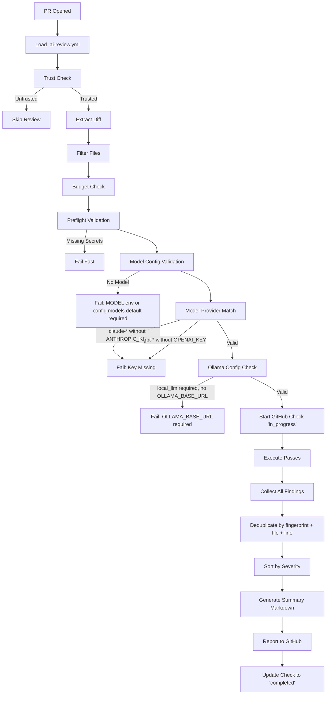
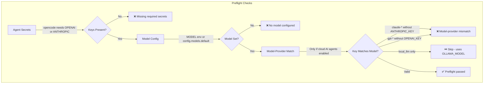
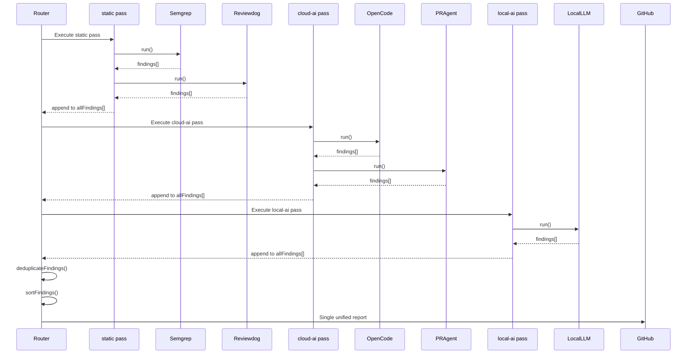
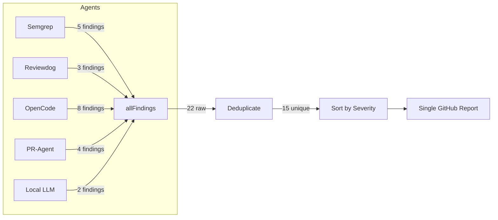
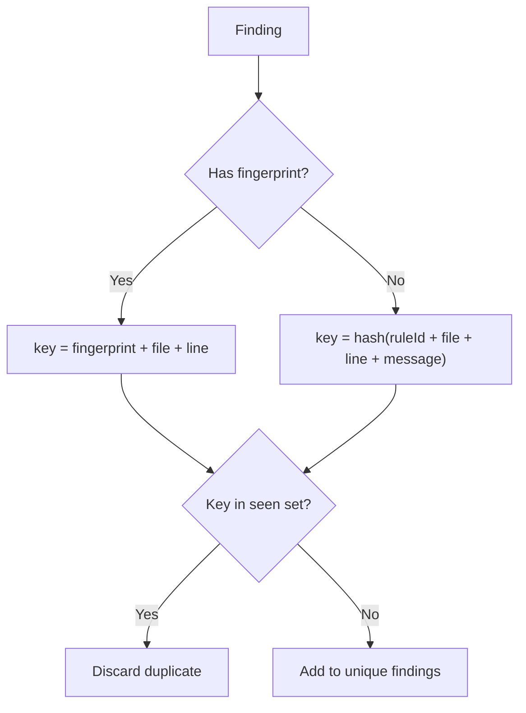
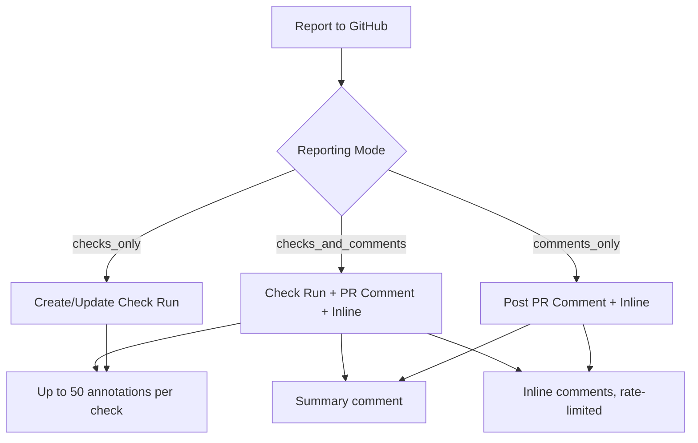
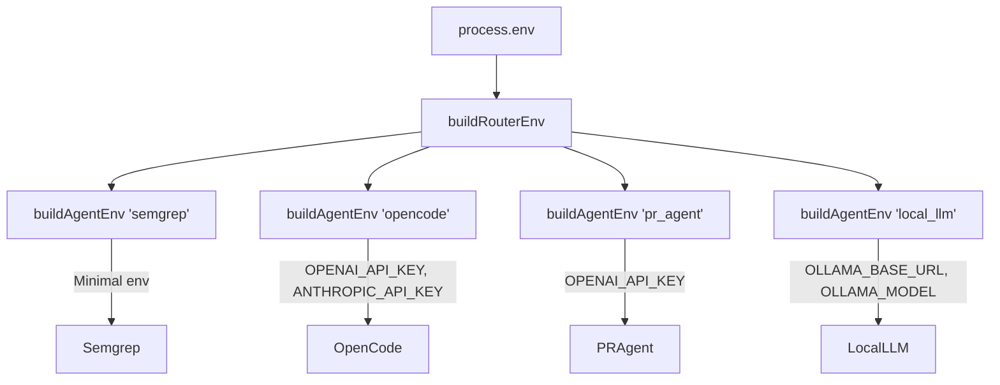

# AI Review Router - Execution Flow

This document describes how odd-ai-reviewers executes agents and consolidates findings.

## Key Insight

**All agents share their findings.** The router collects findings from every agent into a single array, deduplicates them, sorts by severity, and posts **one unified report** to GitHub.

---

## High-Level Flow



---

## Preflight Validation Detail

Preflight validation runs **before any agent execution**, catching misconfigurations early.



### Model-Provider Heuristic

The router infers provider from model name **as a heuristic** (not a contract).

**Scoping**: This validation only runs when cloud AI agents (`opencode`, `pr_agent`, `ai_semantic_review`) are enabled. If only `local_llm` is enabled, it's skipped entirely because `local_llm` uses `OLLAMA_MODEL`, not `MODEL`.

| Model Prefix    | Inferred Provider | Required Key                               |
| --------------- | ----------------- | ------------------------------------------ |
| `claude-*`      | Anthropic         | `ANTHROPIC_API_KEY`                        |
| `gpt-*`, `o1-*` | OpenAI            | `OPENAI_API_KEY` or `AZURE_OPENAI_API_KEY` |
| Unknown         | No validation     | Any available key                          |

### Ollama Configuration

`OLLAMA_BASE_URL` is **not required** at preflight. The `local_llm` agent defaults to `http://ollama-sidecar:11434` when unset. Connectivity failures are handled at runtime (fail-closed by default, or graceful if `LOCAL_LLM_OPTIONAL=true`).

---

## Pass Execution Detail

Passes execute **sequentially** (not in parallel). Within each pass, agents also execute **sequentially**.



---

## Finding Consolidation

All agents contribute to a **single findings array**. Deduplication prevents the same issue from being reported twice.



---

## Deduplication Algorithm

Findings are deduplicated using a composite key:

```
key = fingerprint || (ruleId + file + line + message)
```



---

## GitHub Reporting

The router posts findings in **one atomic operation**:

| Reporting Mode        | Check Run | PR Comment | Inline Comments |
| --------------------- | --------- | ---------- | --------------- |
| `checks_only`         | ✅        | ❌         | ❌              |
| `comments_only`       | ❌        | ✅         | ✅              |
| `checks_and_comments` | ✅        | ✅         | ✅              |



---

## Agent Execution Context

Each agent receives a **scoped context** with only its allowed environment variables (security allowlist):



---

## Summary

1. **Sequential execution**: Passes run in order, agents within passes run in order
2. **Shared findings**: All agents contribute to a single `allFindings[]` array
3. **Deduplication**: Router removes duplicates before reporting
4. **Single report**: One unified GitHub check run and/or PR comment
5. **Scoped security**: Each agent sees only its allowed environment variables

---

## Related Documentation

- [Configuration Schema](./config-schema.md) — All YAML options
- [Security Model](./SECURITY.md) — Trust boundaries and threat model
- [Invariants](./INVARIANTS.md) — Non-negotiable design constraints
- [Scope](./SCOPE.md) — What this project does and doesn't do
