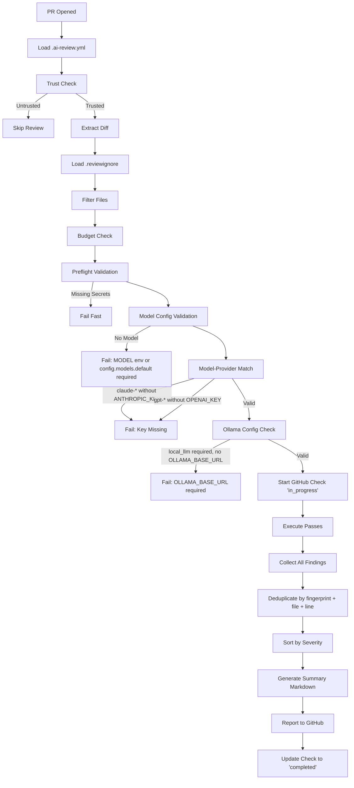
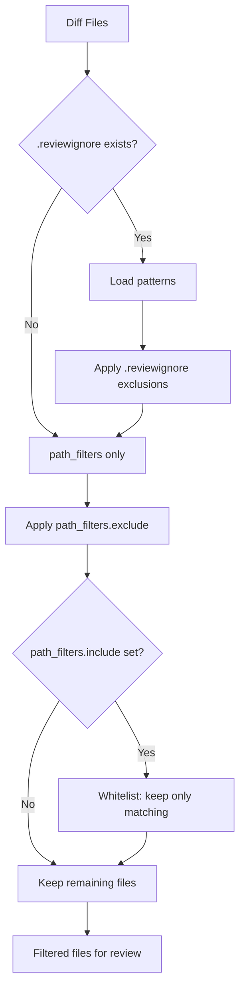
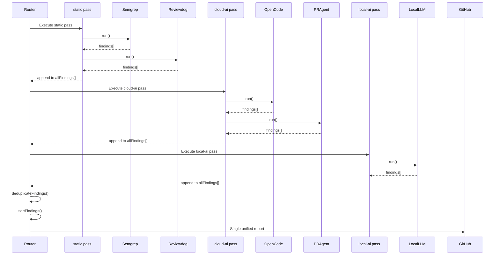
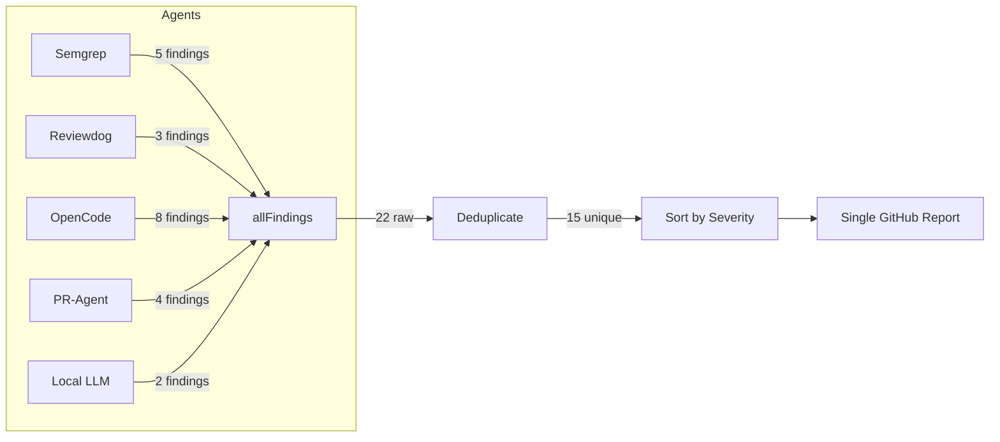
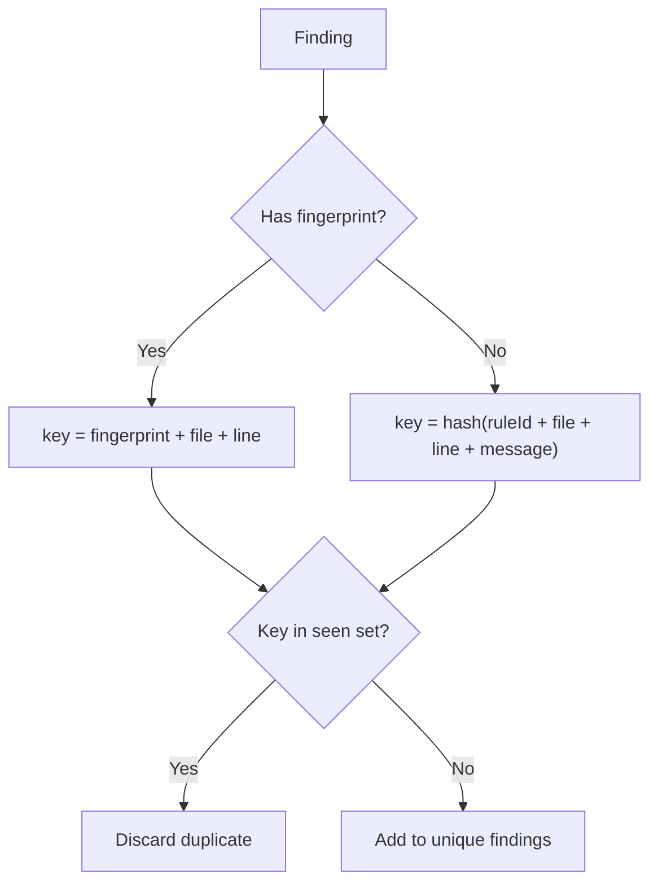
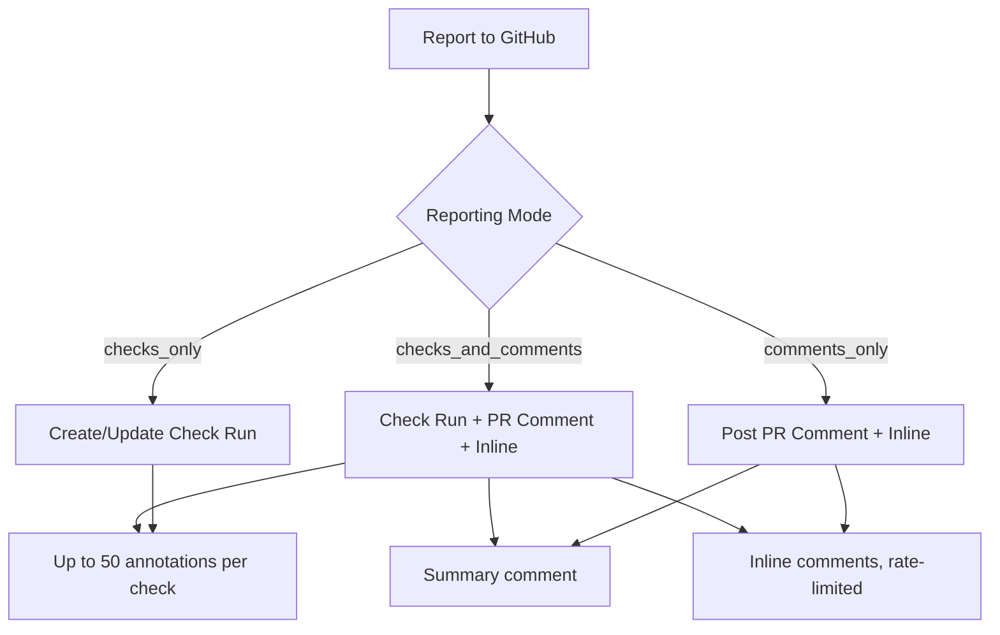
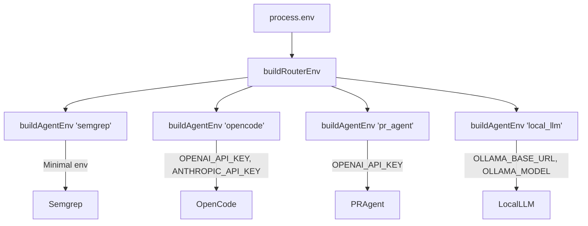

# AI Review Router - Execution Flow

This document describes how odd-ai-reviewers executes agents and consolidates findings.

## Key Insight

**All agents share their findings.** The router collects findings from every agent into a single array, deduplicates them, sorts by severity, and posts **one unified report** to GitHub.

---

## High-Level Flow



---

## File Filtering

After extracting the diff, the router filters files based on two mechanisms:

1. **`.reviewignore`** — A file at repo root using `.gitignore`-compatible syntax
2. **`path_filters`** — YAML configuration in `.ai-review.yml`



### Filter Precedence

> 📖 For detailed filter precedence and pattern syntax, see [Configuration Schema](./config-schema.md#filter-precedence).

Filters are applied in order: `.reviewignore` → `path_filters.exclude` → `path_filters.include`.

### Logging

The router logs filtering results separately:

```
[router] 15 files after filtering
[router]   - 3 excluded by .reviewignore
[router]   - 2 excluded by path_filters
```

---

## Preflight Validation Detail

Preflight validation runs **before any agent execution**, catching misconfigurations early.

```mermaid
flowchart TD
    subgraph Preflight Checks
        A[Agent Secrets] -->|"opencode needs OPENAI or ANTHROPIC"| Check1{Keys Present?}
        Check1 -->|No| Fail1[❌ Missing required secrets]
        Check1 -->|Yes| B[Model Config]

        B -->|"MODEL env or config.models.default"| Check2{Model Set?}
        Check2 -->|No| Fail2[❌ No model configured]
        Check2 -->|Yes| C[Model-Provider Match]

        C -->|"Only if cloud AI agents enabled"| Check3{Key Matches Model?}
        Check3 -->|"claude-* without ANTHROPIC_KEY"| Fail3[❌ Model-provider mismatch]
        Check3 -->|"gpt-* without OPENAI_KEY"| Fail3
        Check3 -->|local_llm only| Skip[⏭️ Skip - uses OLLAMA_MODEL]
        Check3 -->|Valid| Pass[✅ Preflight passed]
    end
```



### Model-Provider Heuristic

The router infers provider from model name **as a heuristic** (not a contract).

**Scoping**: This validation only runs when cloud AI agents (`opencode`, `pr_agent`, `ai_semantic_review`) are enabled. If only `local_llm` is enabled, it's skipped entirely because `local_llm` uses `OLLAMA_MODEL`, not `MODEL`.

| Model Prefix    | Inferred Provider | Required Key                               |
| --------------- | ----------------- | ------------------------------------------ |
| `claude-*`      | Anthropic         | `ANTHROPIC_API_KEY`                        |
| `gpt-*`, `o1-*` | OpenAI            | `OPENAI_API_KEY` or `AZURE_OPENAI_API_KEY` |
| Unknown         | No validation     | Any available key                          |

### Ollama Configuration

`OLLAMA_BASE_URL` is **not required** at preflight. The `local_llm` agent defaults to `http://ollama-sidecar:11434` when unset. Connectivity failures are handled at runtime (fail-closed by default, or graceful if `LOCAL_LLM_OPTIONAL=true`).

---

## Pass Execution Detail

Passes execute **sequentially** (not in parallel). Within each pass, agents also execute **sequentially**.



---

## Finding Consolidation

All agents contribute to a **single findings array**. Deduplication prevents the same issue from being reported twice.



---

## Deduplication Algorithm

Findings are deduplicated using a composite key:

```
key = fingerprint || (ruleId + file + line + message)
```



---

## GitHub Reporting

The router posts findings in **one atomic operation**:

| Reporting Mode        | Check Run | PR Comment | Inline Comments |
| --------------------- | --------- | ---------- | --------------- |
| `checks_only`         | ✅        | ❌         | ❌              |
| `comments_only`       | ❌        | ✅         | ✅              |
| `checks_and_comments` | ✅        | ✅         | ✅              |



---

## Agent Execution Context

Each agent receives a **scoped context** with only its allowed environment variables (security allowlist):



---

## Summary

1. **File filtering**: `.reviewignore` and `path_filters` control which files are reviewed
2. **Sequential execution**: Passes run in order, agents within passes run in order
3. **Shared findings**: All agents contribute to a single `allFindings[]` array
4. **Deduplication**: Router removes duplicates before reporting
5. **Single report**: One unified GitHub check run and/or PR comment
6. **Scoped security**: Each agent sees only its allowed environment variables

---

## Related Documentation

- [Configuration Schema](./config-schema.md) — All YAML options
- [Security Model](./security.md) — Trust boundaries and threat model
- [Invariants](./INVARIANTS.md) — Non-negotiable design constraints
- [Scope](./SCOPE.md) — What this project does and doesn't do
