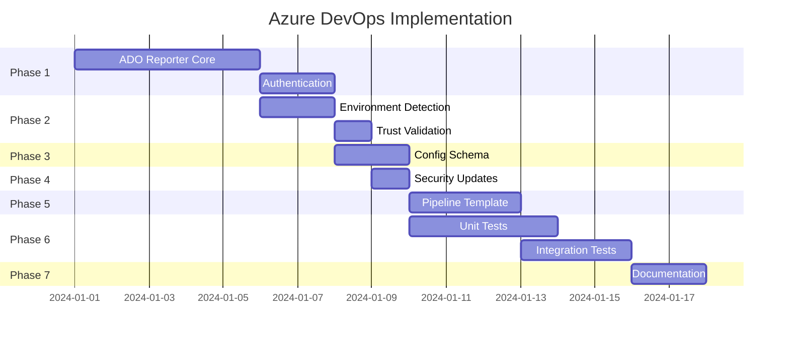

# Azure DevOps Implementation Plan

> Enterprise-grade Azure DevOps support with full GitHub feature parity

This document outlines the comprehensive implementation plan to add Azure DevOps (ADO) support to odd-ai-reviewers, ensuring complete feature parity with the existing GitHub integration while maintaining the security model, invariants, and testing standards established in the codebase.

---

## Executive Summary

### Current State

| Capability                 | GitHub      | Azure DevOps       |
| -------------------------- | ----------- | ------------------ |
| PR Commenting              | ✅ Complete | 🔴 Not implemented |
| Check Runs / Build Status  | ✅ Complete | 🔴 Not implemented |
| Inline Annotations         | ✅ Complete | 🔴 Not implemented |
| Reusable Pipeline          | ✅ Complete | ⚠️ Stub only       |
| Trust Validation           | ✅ Complete | 🔴 Not implemented |
| Environment Detection      | ✅ Complete | 🔴 Not implemented |
| Deduplication              | ✅ Complete | ⏳ Will reuse      |
| Cost Controls              | ✅ Complete | ⏳ Will reuse      |
| Security (Token Stripping) | ✅ Complete | ⏳ Partially ready |

### Target State

Full feature parity with GitHub integration, including:

- PR thread comments with inline code annotations
- Build/pipeline status reporting
- Draft PR detection and skipping
- Fork PR blocking (when `trusted_only: true`)
- Comment deduplication via fingerprint markers
- Rate limiting for inline comments
- Configurable reporting modes

---

## Architecture Overview

### Provider-Neutral Design (Invariant 4)

The implementation follows the established pattern of provider-neutral core logic with isolated provider-specific modules:

```
router/src/
├── main.ts                    # Provider detection & dispatch
├── config.ts                  # Add ADO reporting schema
├── trust.ts                   # Add ADO context builder
├── report/
│   ├── github.ts             # Existing GitHub reporter
│   ├── ado.ts                # NEW: Azure DevOps reporter
│   └── formats.ts            # Shared formatting (unchanged)
└── agents/
    └── security.ts           # Token stripping (ADO tokens ready)
```

### Component Responsibilities

| Component            | Responsibility                                               |
| -------------------- | ------------------------------------------------------------ |
| `main.ts`            | Detect platform, build context, dispatch to correct reporter |
| `config.ts`          | Parse ADO reporting config, validate schema                  |
| `trust.ts`           | Build ADO PR context, validate fork/draft status             |
| `report/ado.ts`      | ADO REST API calls for threads, status, comments             |
| `report/formats.ts`  | Shared markdown/fingerprint generation (no changes)          |
| `agents/security.ts` | Strip ADO tokens from agent environments                     |

---

## Phase 1: ADO Reporter Module

**Priority: High** | **Effort: 5-7 days**

### 1.1 File: `router/src/report/ado.ts`

Create a new reporter module mirroring `github.ts` functionality.

#### ADO Context Interface

```typescript
export interface ADOContext {
  /** Azure DevOps organization name */
  organization: string;
  /** Azure DevOps project name */
  project: string;
  /** Repository ID or name */
  repositoryId: string;
  /** Pull Request ID */
  pullRequestId: number;
  /** Source commit SHA for the PR */
  sourceRefCommit: string;
  /** Authentication token (System.AccessToken or PAT) */
  token: string;
}
```

#### Core Functions to Implement

| Function                | GitHub Equivalent              | ADO API Endpoint                                          |
| ----------------------- | ------------------------------ | --------------------------------------------------------- |
| `startBuildStatus()`    | `startCheckRun()`              | Pipeline status via build API                             |
| `reportToADO()`         | `reportToGitHub()`             | Orchestrates all reporting                                |
| `createPRThread()`      | `postPRComment()`              | `POST /_apis/git/pullRequests/{prId}/threads`             |
| `updatePRThread()`      | `updateComment()`              | `PATCH /_apis/git/pullRequests/{prId}/threads/{threadId}` |
| `createInlineComment()` | `createReviewComment()`        | Thread with `threadContext` position                      |
| `updateBuildStatus()`   | `createCheckRun()` (completed) | Build status genre                                        |

#### ADO REST API Reference

**Base URL Pattern:**

```
https://dev.azure.com/{organization}/{project}/_apis/git/repositories/{repositoryId}/pullRequests/{pullRequestId}
```

**Key Endpoints:**

1. **PR Threads (Comments)**

   ```
   POST /threads?api-version=7.1
   {
     "comments": [{ "content": "markdown content", "commentType": 1 }],
     "status": 1,  // 1=Active, 2=Fixed, 3=WontFix, 4=Closed, 5=ByDesign, 6=Pending
     "threadContext": {  // For inline comments
       "filePath": "/src/file.ts",
       "rightFileStart": { "line": 10, "offset": 1 },
       "rightFileEnd": { "line": 10, "offset": 1 }
     }
   }
   ```

2. **Build Status (equivalent to Check Runs)**

   ```
   POST /{project}/_apis/build/builds/{buildId}/status?api-version=7.1
   ```

   Or use **Statuses API** for commit status:

   ```
   POST /statuses/{commitId}?api-version=7.1
   {
     "state": "pending|succeeded|failed|error",
     "description": "AI Code Review in progress...",
     "context": { "name": "AI Code Review", "genre": "continuous-integration" }
   }
   ```

### 1.2 Authentication Handling

**Supported Authentication Methods:**

| Method                | Environment Variable | Use Case                 |
| --------------------- | -------------------- | ------------------------ |
| System.AccessToken    | `SYSTEM_ACCESSTOKEN` | Azure Pipelines jobs     |
| Personal Access Token | `AZURE_DEVOPS_PAT`   | Local testing, cross-org |
| Managed Identity      | N/A (auto)           | Azure-hosted resources   |

**Token Resolution Logic:**

```typescript
function resolveADOToken(env: Record<string, string | undefined>): string | null {
  // 1. System.AccessToken (Azure Pipelines native)
  if (env['SYSTEM_ACCESSTOKEN']) return env['SYSTEM_ACCESSTOKEN'];

  // 2. Explicit PAT (cross-org or local testing)
  if (env['AZURE_DEVOPS_PAT']) return env['AZURE_DEVOPS_PAT'];

  return null;
}
```

### 1.3 Reporting Modes (Parity with GitHub)

Extend config schema to support ADO reporting modes:

```yaml
reporting:
  ado:
    mode: threads_and_status # threads_only | status_only | threads_and_status
    max_inline_comments: 20
    summary: true
```

**Mode Mapping:**

| ADO Mode             | GitHub Equivalent     | Behavior                       |
| -------------------- | --------------------- | ------------------------------ |
| `threads_only`       | `comments_only`       | PR threads + inline, no status |
| `status_only`        | `checks_only`         | Build status only, no comments |
| `threads_and_status` | `checks_and_comments` | Both (default)                 |

### 1.4 Comment Deduplication

Reuse existing fingerprint marker system from `formats.ts`:

```typescript
// Same marker format works in ADO threads
const marker = buildFingerprintMarker(finding);
// <!-- odd-ai-reviewers:fingerprint:v1:abc123def456:src/file.ts:10 -->
```

**Deduplication Flow:**

1. Fetch existing PR threads via `GET /threads`
2. Extract fingerprint markers from thread comments
3. Skip posting findings already present
4. Post only new/changed findings

### 1.5 Inline Comment Position Mapping

ADO uses `threadContext` for inline comments. Map Finding to ADO format:

```typescript
interface ADOThreadContext {
  filePath: string; // From finding.file (prepend '/' if needed)
  rightFileStart: {
    line: number; // From finding.line
    offset: number; // Always 1 (start of line)
  };
  rightFileEnd: {
    line: number; // From finding.endLine ?? finding.line
    offset: number; // Always 1
  };
}

function toADOThreadContext(finding: Finding): ADOThreadContext | null {
  if (!finding.line) return null;

  return {
    filePath: finding.file.startsWith('/') ? finding.file : `/${finding.file}`,
    rightFileStart: { line: finding.line, offset: 1 },
    rightFileEnd: { line: finding.endLine ?? finding.line, offset: 1 },
  };
}
```

---

## Phase 2: Trust & Environment Detection

**Priority: High** | **Effort: 2-3 days**

### 2.1 ADO Environment Variables

Azure Pipelines provides these predefined variables:

| Variable                                 | Purpose             | Required                     |
| ---------------------------------------- | ------------------- | ---------------------------- |
| `SYSTEM_ACCESSTOKEN`                     | Pipeline auth token | Yes (for posting)            |
| `BUILD_REPOSITORY_URI`                   | Repository URL      | Yes (org/project extraction) |
| `SYSTEM_PULLREQUEST_PULLREQUESTID`       | PR number           | Yes (for PR context)         |
| `SYSTEM_PULLREQUEST_SOURCEBRANCH`        | Source branch ref   | Yes                          |
| `SYSTEM_PULLREQUEST_TARGETBRANCH`        | Target branch ref   | Yes                          |
| `SYSTEM_PULLREQUEST_SOURCEREPOSITORYURI` | Fork source URL     | Yes (fork detection)         |
| `BUILD_SOURCEVERSION`                    | Head commit SHA     | Yes                          |
| `BUILD_REASON`                           | Trigger reason      | Yes (PR vs push)             |
| `SYSTEM_TEAMFOUNDATIONCOLLECTIONURI`     | ADO base URL        | Yes                          |
| `SYSTEM_TEAMPROJECT`                     | Project name        | Yes                          |
| `BUILD_REPOSITORY_NAME`                  | Repository name     | Yes                          |

### 2.2 Platform Detection in `main.ts`

```typescript
type Platform = 'github' | 'ado' | 'unknown';

function detectPlatform(env: Record<string, string | undefined>): Platform {
  // GitHub Actions
  if (env['GITHUB_ACTIONS'] === 'true') return 'github';

  // Azure Pipelines
  if (env['TF_BUILD'] === 'True' || env['SYSTEM_TEAMFOUNDATIONCOLLECTIONURI']) return 'ado';

  return 'unknown';
}
```

### 2.3 ADO PR Context Builder

Add to `trust.ts`:

```typescript
export interface ADOPullRequestContext {
  pullRequestId: number;
  sourceRepoUri: string;
  targetRepoUri: string;
  sourceBranch: string;
  targetBranch: string;
  author: string; // Not directly available - may need API call
  isFork: boolean;
  isDraft: boolean; // Requires API call to PR details
}

export function buildADOPRContext(
  env: Record<string, string | undefined>
): ADOPullRequestContext | null {
  const prId = env['SYSTEM_PULLREQUEST_PULLREQUESTID'];
  if (!prId) return null; // Not a PR build

  const sourceRepoUri = env['SYSTEM_PULLREQUEST_SOURCEREPOSITORYURI'] ?? '';
  const targetRepoUri = env['BUILD_REPOSITORY_URI'] ?? '';

  return {
    pullRequestId: parseInt(prId, 10),
    sourceRepoUri,
    targetRepoUri,
    sourceBranch: env['SYSTEM_PULLREQUEST_SOURCEBRANCH'] ?? '',
    targetBranch: env['SYSTEM_PULLREQUEST_TARGETBRANCH'] ?? '',
    author: env['BUILD_REQUESTEDFOR'] ?? 'unknown',
    isFork: sourceRepoUri !== '' && sourceRepoUri !== targetRepoUri,
    isDraft: false, // Default - needs API enrichment
  };
}
```

### 2.4 Draft PR Detection

ADO doesn't expose draft status via environment variables. Requires API call:

```typescript
async function isPRDraft(context: ADOContext): Promise<boolean> {
  const response = await fetch(
    `${context.organization}/${context.project}/_apis/git/repositories/${context.repositoryId}/pullRequests/${context.pullRequestId}?api-version=7.1`,
    { headers: { Authorization: `Bearer ${context.token}` } }
  );
  const pr = await response.json();
  return pr.isDraft === true;
}
```

---

## Phase 3: Configuration Schema Extensions

**Priority: Medium** | **Effort: 1-2 days**

### 3.1 Config Schema Updates

Extend `config.ts` with ADO-specific reporting options:

```typescript
const ADOReportingSchema = z.object({
  mode: z.enum(['threads_only', 'status_only', 'threads_and_status']).default('threads_and_status'),
  max_inline_comments: z.number().default(20),
  summary: z.boolean().default(true),
  /** Thread status for new findings: Active (1), Pending (6) */
  thread_status: z.enum(['active', 'pending']).default('active'),
});

const ReportingSchema = z.object({
  github: GithubReportingSchema.optional(),
  ado: ADOReportingSchema.optional(), // NEW
});
```

### 3.2 Example Configuration

```yaml
version: 1
trusted_only: true

passes:
  - name: static
    agents: [semgrep]
    enabled: true
    required: true
  - name: ai
    agents: [opencode]
    enabled: true

reporting:
  # GitHub config (used when GITHUB_ACTIONS=true)
  github:
    mode: checks_and_comments
    max_inline_comments: 20

  # ADO config (used when TF_BUILD=True)
  ado:
    mode: threads_and_status
    max_inline_comments: 20
    thread_status: active
```

---

## Phase 4: Security Module Updates

**Priority: High** | **Effort: 1 day**

### 4.1 Token Stripping (Already Implemented)

The security module already strips ADO tokens:

```typescript
// From agents/security.ts - already present
const TOKEN_PATTERNS = [
  // Azure DevOps tokens
  'AZURE_DEVOPS_PAT',
  'ADO_TOKEN',
  'SYSTEM_ACCESSTOKEN',
  // ...
];
```

### 4.2 Router Environment Allowlist Update

Add ADO environment variables to `ROUTER_ENV_ALLOWLIST`:

```typescript
const ROUTER_ENV_ALLOWLIST = [
  // Existing GitHub vars...

  // Azure DevOps CI context (router-only)
  'SYSTEM_ACCESSTOKEN', // ADO pipeline token
  'SYSTEM_TEAMFOUNDATIONCOLLECTIONURI',
  'SYSTEM_TEAMPROJECT',
  'BUILD_REPOSITORY_URI',
  'BUILD_REPOSITORY_NAME',
  'BUILD_SOURCEVERSION',
  'BUILD_REASON',
  'SYSTEM_PULLREQUEST_PULLREQUESTID',
  'SYSTEM_PULLREQUEST_SOURCEBRANCH',
  'SYSTEM_PULLREQUEST_TARGETBRANCH',
  'SYSTEM_PULLREQUEST_SOURCEREPOSITORYURI',
  'BUILD_REQUESTEDFOR',
  'TF_BUILD',

  // Cross-platform
  'CI',
];
```

---

## Phase 5: Pipeline Template Completion

**Priority: Medium** | **Effort: 2-3 days**

### 5.1 Complete `templates/ado/ai-review-template.yml`

```yaml
# Azure DevOps AI Review Template
# Extend this template in your azure-pipelines.yml

parameters:
  - name: targetRepo
    type: string
    displayName: 'Target Repository'
  - name: targetRef
    type: string
    displayName: 'Target Git Ref'
  - name: baseRef
    type: string
    default: 'main'
    displayName: 'Base Git Ref for diff'
  - name: prNumber
    type: number
    default: 0
    displayName: 'PR Number (0 if not a PR)'
  - name: agentPool
    type: string
    default: 'ubuntu-latest'
    displayName: 'Agent pool (vmImage or pool name)'
  - name: nodeVersion
    type: string
    default: '22.x'
    displayName: 'Node.js version'

stages:
  - stage: AIReview
    displayName: 'AI Code Review'
    jobs:
      - job: Review
        displayName: 'Run AI Review'
        pool:
          vmImage: ${{ parameters.agentPool }}

        variables:
          - group: ai-review-secrets # Contains OPENAI_API_KEY, ANTHROPIC_API_KEY

        steps:
          # Checkout the router repository
          - checkout: self
            displayName: 'Checkout AI Review Router'
            path: router

          # Checkout target repository
          - checkout: git://${{ parameters.targetRepo }}@${{ parameters.targetRef }}
            displayName: 'Checkout Target Repository'
            path: target
            fetchDepth: 0

          # Setup Node.js
          - task: NodeTool@0
            displayName: 'Setup Node.js'
            inputs:
              versionSpec: ${{ parameters.nodeVersion }}

          # Install dependencies
          - script: |
              corepack enable
              pnpm install --frozen-lockfile
            displayName: 'Install Router Dependencies'
            workingDirectory: $(Pipeline.Workspace)/router

          # Build the router
          - script: pnpm build
            displayName: 'Build Router'
            workingDirectory: $(Pipeline.Workspace)/router

          # Install Semgrep
          - script: pip3 install semgrep==1.148.0
            displayName: 'Install Semgrep'

          # Determine base SHA
          - script: |
              cd $(Pipeline.Workspace)/target
              if [ -n "$(System.PullRequest.TargetBranch)" ]; then
                BASE_SHA=$(git rev-parse origin/$(System.PullRequest.TargetBranch))
              else
                BASE_SHA=$(git rev-parse origin/${{ parameters.baseRef }})
              fi
              echo "##vso[task.setvariable variable=BASE_SHA]$BASE_SHA"
            displayName: 'Determine Base SHA'

          # Run AI Review
          - script: |
              node $(Pipeline.Workspace)/router/dist/main.js review \
                --repo $(Pipeline.Workspace)/target \
                --base $(BASE_SHA) \
                --head ${{ parameters.targetRef }} \
                --pr ${{ parameters.prNumber }}
            displayName: 'Run AI Review'
            env:
              SYSTEM_ACCESSTOKEN: $(System.AccessToken)
              OPENAI_API_KEY: $(OPENAI_API_KEY)
              ANTHROPIC_API_KEY: $(ANTHROPIC_API_KEY)
              TF_BUILD: $(TF_BUILD)
              SYSTEM_TEAMFOUNDATIONCOLLECTIONURI: $(System.TeamFoundationCollectionUri)
              SYSTEM_TEAMPROJECT: $(System.TeamProject)
              BUILD_REPOSITORY_URI: $(Build.Repository.Uri)
              BUILD_REPOSITORY_NAME: $(Build.Repository.Name)
              BUILD_SOURCEVERSION: $(Build.SourceVersion)
              SYSTEM_PULLREQUEST_PULLREQUESTID: $(System.PullRequest.PullRequestId)

          # Upload artifacts
          - task: PublishPipelineArtifact@1
            displayName: 'Upload Review Results'
            condition: always()
            inputs:
              targetPath: $(Pipeline.Workspace)/router/review-*.json
              artifact: ai-review-results
```

### 5.2 Usage Example for Target Repos

```yaml
# azure-pipelines.yml in target repository
trigger:
  - main

pr:
  - main
  - develop

resources:
  repositories:
    - repository: odd-ai-reviewers
      type: git
      name: oddessentials/odd-ai-reviewers
      ref: main

extends:
  template: templates/ado/ai-review-template.yml@odd-ai-reviewers
  parameters:
    targetRepo: $(Build.Repository.Name)
    targetRef: $(Build.SourceVersion)
    prNumber: $(System.PullRequest.PullRequestId)
```

---

## Phase 6: Testing Strategy

**Priority: Critical** | **Effort: 5-7 days**

### 6.1 Test Files to Create

Following the established testing patterns:

| Test File                   | Purpose                             | GitHub Equivalent                     |
| --------------------------- | ----------------------------------- | ------------------------------------- |
| `ado.test.ts`               | ADO reporter unit tests             | `check_run_lifecycle.test.ts`         |
| `ado_threads.test.ts`       | Thread creation/update tests        | Part of `check_run_lifecycle.test.ts` |
| `ado_deduplication.test.ts` | Fingerprint extraction from threads | `deduplication.test.ts`               |
| `ado_trust.test.ts`         | ADO PR context validation           | `trust.test.ts`                       |
| `ado_security.test.ts`      | ADO token stripping                 | `security.test.ts`                    |
| `ado_integration.test.ts`   | End-to-end ADO flow                 | `integration/router.test.ts`          |

### 6.2 Test Structure for `ado.test.ts`

```typescript
// router/src/__tests__/ado.test.ts
import { describe, it, expect, vi, beforeEach } from 'vitest';

// Mock fetch for ADO API calls
const mockFetch = vi.fn();
global.fetch = mockFetch;

describe('ADO Reporter', () => {
  describe('startBuildStatus', () => {
    it('should create pending status on PR commit', async () => {
      // Similar to check_run_lifecycle.test.ts startCheckRun tests
    });

    it('should include started_at timestamp', async () => {
      // ...
    });
  });

  describe('reportToADO with statusThreadId (proper lifecycle)', () => {
    it('should UPDATE existing thread when statusThreadId provided', async () => {
      // Mirror the GitHub update vs create pattern
    });
  });

  describe('createPRThread', () => {
    it('should create summary thread with markdown content', async () => {
      // ...
    });

    it('should create inline thread with threadContext', async () => {
      // ...
    });
  });

  describe('Comment deduplication', () => {
    it('should skip posting when fingerprint exists in thread', async () => {
      // Reuse fingerprint marker extraction logic
    });

    it('should extract fingerprints from existing threads', async () => {
      // Test extractFingerprintMarkers on ADO thread format
    });
  });

  describe('Mode gating', () => {
    it('should NOT create threads when mode is status_only', async () => {
      // Mirror GitHub comments_only test
    });

    it('should NOT update status when mode is threads_only', async () => {
      // ...
    });
  });
});

describe('ADO Context Building', () => {
  it('should correctly build context from ADO environment', () => {
    // Test buildADOPRContext
  });

  it('should detect fork PRs from different source URI', () => {
    // ...
  });
});
```

### 6.3 Security Tests for ADO

Add to `security.test.ts`:

```typescript
describe('ADO Token Stripping (Invariant 7)', () => {
  it('should strip SYSTEM_ACCESSTOKEN', () => {
    const env = {
      SYSTEM_ACCESSTOKEN: 'ey...',
      PATH: '/usr/bin',
    };
    const result = stripTokensFromEnv(env);
    expect(result['SYSTEM_ACCESSTOKEN']).toBeUndefined();
  });

  it('should strip AZURE_DEVOPS_PAT', () => {
    const env = {
      AZURE_DEVOPS_PAT: 'pat-xxx',
      PATH: '/usr/bin',
    };
    const result = stripTokensFromEnv(env);
    expect(result['AZURE_DEVOPS_PAT']).toBeUndefined();
  });

  it.each(['semgrep', 'opencode', 'local_llm'])(
    'SYSTEM_ACCESSTOKEN never passed to %s agent',
    (agentId) => {
      const env = {
        SYSTEM_ACCESSTOKEN: 'ey...',
        OPENAI_API_KEY: 'sk-xxx',
      };
      const agentEnv = buildAgentEnv(agentId as AgentId, env);
      expect(agentEnv['SYSTEM_ACCESSTOKEN']).toBeUndefined();
    }
  );
});
```

### 6.4 Trust Tests for ADO

Add to `trust.test.ts`:

```typescript
describe('ADO Trust Validation', () => {
  it('should block fork PRs when trusted_only is true', () => {
    const context: ADOPullRequestContext = {
      pullRequestId: 123,
      sourceRepoUri: 'https://dev.azure.com/fork-org/project/_git/repo',
      targetRepoUri: 'https://dev.azure.com/main-org/project/_git/repo',
      sourceBranch: 'refs/heads/feature',
      targetBranch: 'refs/heads/main',
      author: 'fork-user',
      isFork: true,
      isDraft: false,
    };

    const result = checkADOTrust(context, { ...baseConfig, trusted_only: true });
    expect(result.trusted).toBe(false);
  });

  it('should detect fork from different source URI', () => {
    const env = {
      SYSTEM_PULLREQUEST_SOURCEREPOSITORYURI: 'https://dev.azure.com/fork/_git/repo',
      BUILD_REPOSITORY_URI: 'https://dev.azure.com/main/_git/repo',
      SYSTEM_PULLREQUEST_PULLREQUESTID: '123',
    };

    const context = buildADOPRContext(env);
    expect(context?.isFork).toBe(true);
  });
});
```

---

## Phase 7: Documentation Updates

**Priority: Medium** | **Effort: 2 days**

### 7.1 New Documentation Files

| File                          | Purpose                        |
| ----------------------------- | ------------------------------ |
| `docs/ADO-SETUP.md`           | Azure DevOps integration guide |
| `docs/ADO-VARIABLE-GROUPS.md` | Secret configuration for ADO   |

### 7.2 Updates to Existing Documentation

| File                    | Changes                      |
| ----------------------- | ---------------------------- |
| `docs/ROADMAP.md`       | Mark Phase 1 & 2 as complete |
| `docs/config-schema.md` | Add ADO reporting schema     |
| `docs/ARCHITECTURE.md`  | Add ADO flow diagram         |
| `README.md`             | Add ADO quick start section  |

### 7.3 ADO-SETUP.md Outline

```markdown
# Azure DevOps Setup Guide

## Prerequisites

- Azure DevOps organization with Git repositories
- Azure Pipelines enabled
- Variable group for secrets

## Quick Start

### 1. Create Variable Group

### 2. Configure Pipeline Permissions

### 3. Add Pipeline YAML

### 4. Test with a PR

## Authentication Options

### System.AccessToken (Recommended)

### Personal Access Token

### Managed Identity

## Configuration Reference

### Environment Variables

### Reporting Modes

### Trust Configuration

## Troubleshooting

### Common Issues

### Debug Logging
```

---

## Implementation Order & Dependencies



### Dependency Graph

```
Phase 1 (Reporter) ──┬──> Phase 2 (Trust) ──> Phase 4 (Security)
                     │
                     └──> Phase 3 (Config) ──> Phase 5 (Pipeline)
                                                      │
Phase 4 + Phase 5 ──────────────────────────────────> Phase 6 (Tests)
                                                      │
                                                      └──> Phase 7 (Docs)
```

---

## Invariants Compliance Checklist

Each implementation phase must verify compliance with INVARIANTS.md:

| #   | Invariant                                | Verification                                                 |
| --- | ---------------------------------------- | ------------------------------------------------------------ |
| 1   | Router Owns Posting                      | ADO reporter in router only; agents have no ADO token access |
| 2   | Agents Return Structured Findings        | No changes to agent output format                            |
| 3   | Single Source of Truth for Deduplication | Reuse `formats.ts` deduplication logic                       |
| 4   | Provider-Neutral Core                    | `ado.ts` isolated; core logic unchanged                      |
| 5   | Deterministic Outputs                    | Same fingerprint algorithm; stable ordering                  |
| 7   | No Direct Secrets to Agents              | `SYSTEM_ACCESSTOKEN` stripped from agent env                 |
| 9   | No Fork PR Execution by Default          | ADO fork detection via source URI comparison                 |
| 15  | Bounded Output                           | Respect `max_inline_comments` config                         |
| 19  | Provider Parity Roadmap Discipline       | This plan maintains parity                                   |
| 23  | Tests Enforce Invariants                 | ADO-specific tests for all invariants                        |

---

## Risk Assessment

| Risk                                 | Likelihood | Impact | Mitigation                                         |
| ------------------------------------ | ---------- | ------ | -------------------------------------------------- |
| ADO API rate limiting                | Medium     | Medium | Implement retry with exponential backoff           |
| Thread context position mismatch     | Medium     | Low    | Robust error handling; skip failed inline comments |
| Draft PR detection requires API call | High       | Low    | Cache draft status; accept false negatives         |
| Cross-org authentication complexity  | Low        | Medium | Document PAT setup clearly                         |
| Azure Pipelines variable scoping     | Medium     | Medium | Test in real pipeline before release               |

---

## Success Criteria

1. **Functional Parity**: All GitHub reporting features work equivalently on ADO
2. **Test Coverage**: >80% coverage for new ADO code; all invariant tests pass
3. **Documentation**: Complete setup guide with troubleshooting
4. **Security**: All ADO tokens stripped from agent environments (verified by tests)
5. **Performance**: PR comment posting <30s for typical PRs (20 findings)
6. **Reliability**: Graceful degradation when API calls fail

---

## Appendix A: ADO API Quick Reference

### Authentication Header

```
Authorization: Bearer {token}
```

### Common Status Codes

| Code | Meaning      | Action                  |
| ---- | ------------ | ----------------------- |
| 200  | Success      | Continue                |
| 201  | Created      | Success for POST        |
| 401  | Unauthorized | Check token permissions |
| 403  | Forbidden    | Token lacks scope       |
| 404  | Not Found    | Verify PR/repo IDs      |
| 429  | Rate Limited | Retry with backoff      |

### Required Token Scopes

- `Code (Read & Write)` - For PR threads
- `Build (Read & Execute)` - For status updates

---

## Appendix B: Environment Variable Mapping

| GitHub              | Azure DevOps                             | Purpose            |
| ------------------- | ---------------------------------------- | ------------------ |
| `GITHUB_TOKEN`      | `SYSTEM_ACCESSTOKEN`                     | Auth token         |
| `GITHUB_REPOSITORY` | `BUILD_REPOSITORY_URI`                   | Repo identifier    |
| `GITHUB_SHA`        | `BUILD_SOURCEVERSION`                    | Commit SHA         |
| `GITHUB_REF`        | `BUILD_SOURCEBRANCH`                     | Branch ref         |
| `GITHUB_EVENT_NAME` | `BUILD_REASON`                           | Trigger type       |
| `GITHUB_ACTOR`      | `BUILD_REQUESTEDFOR`                     | User who triggered |
| `GITHUB_HEAD_REPO`  | `SYSTEM_PULLREQUEST_SOURCEREPOSITORYURI` | Fork source        |

---

## Appendix C: File Changes Summary

### New Files

- `router/src/report/ado.ts`
- `router/src/__tests__/ado.test.ts`
- `router/src/__tests__/ado_trust.test.ts`
- `docs/ADO-SETUP.md`
- `docs/ADO-VARIABLE-GROUPS.md`

### Modified Files

- `router/src/main.ts` - Platform detection, ADO dispatch
- `router/src/config.ts` - ADO reporting schema
- `router/src/trust.ts` - ADO context builder
- `router/src/agents/security.ts` - Router env allowlist
- `router/src/__tests__/security.test.ts` - ADO token tests
- `router/src/__tests__/trust.test.ts` - ADO trust tests
- `templates/ado/ai-review-template.yml` - Complete implementation
- `docs/ROADMAP.md` - Mark phases complete
- `docs/config-schema.md` - ADO reporting options
- `docs/ARCHITECTURE.md` - ADO flow diagram
- `README.md` - ADO quick start

---

_Document Version: 1.0_
_Created: 2026-01-22_
_Status: Ready for Implementation Review_
